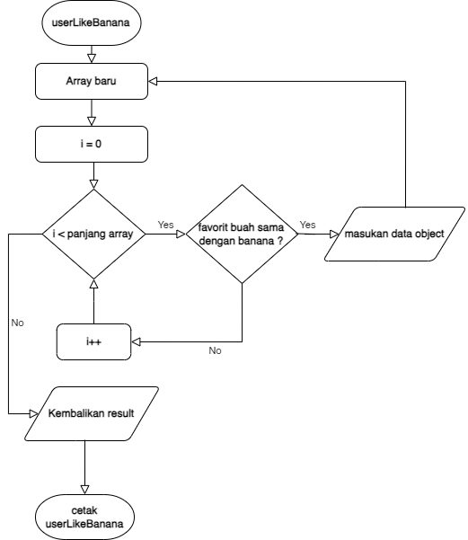

## SOAL

#### 1. tentukan user yang mempunyai buah favorit dia nya banana

#### 2. tentukan user yang gender female dan ada berapa jumlah user nya

#### 3. tentukan user yang registered pada tahun 2014 sampai dengan 2018 dan ada berapa jumlah user nya

#### 4. tentukan user yang mempunya friend bernama Imam dan ada berapa jumlah user nya

#### 5. tentukan user yang eyeColor nya blue dan ada berapa jumlah nya

#### 6. tentukan user yang gender female ATAU user yang eyeColor nya brown dan ada berapa jumlah user nya

#### 7. tentukan user yang tidak mempunya teman bernama Irfi dan Adella dan ada berapa jumlah nya

#### 8. tentukan user yang company huruf depan nya berawal L dan ada berapa jumlah user nya

#### 9. tentukan user yang company huruf belakang nya berawal E dan ada berapa jumlah user nya

#### 10. tentukan user yang berumur dibawah 30 dan registered sesudah tahun 2018 dan berapa jumlah nya

#### 11. tentukan user yang mempunyai teman bernama Grace dan favorit fruit nya apple atau banana

#### 12. tentukan user yang mempunyai nama kurang dari 10 karakter dan umur nya diatas 30 atau gender nya Male dan eyeColor nya brown

#### 13. setiap nama dari user tukar nama belakang dan depan nya, contoh = "imam taufiq" menjadi "taufiq imam"

#### 14. rubah setiap company user menjadi binar dan pada email setiap user berubah menjadi @binar.org, contoh = imam@fsw2.com menjadi imam@binar.org

#### 15. rubah user yang gender female address nya menjadi laut, dan user yang gender male address nya gunung

## FLOWCHART

